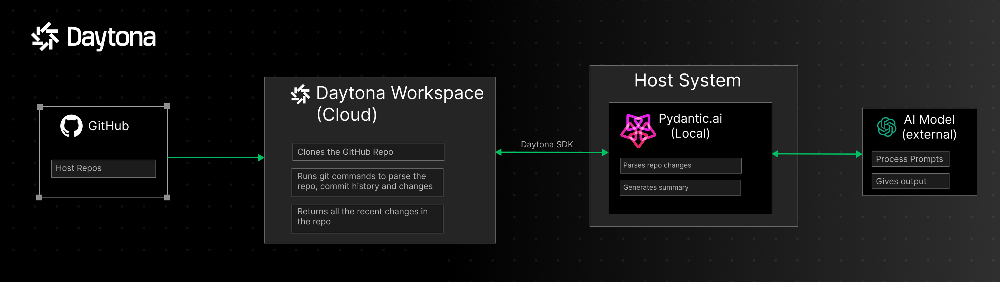
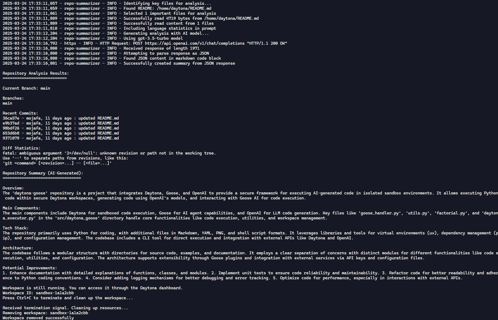

# GitHub Repository Summarizer

## Overview

This tool provides AI-powered analysis and summarization of GitHub repositories. It leverages [Daytona](https://www.daytona.io/) workspaces for secure repository cloning and [PydanticAI](https://ai.pydantic.dev/) framework to connect AI models to generate comprehensive summaries of any repository's purpose, structure, and technical details.

## Features

- **Repository Analysis**: Clones any GitHub repository and analyzes its structure, branches, and commit history
- **Language Detection**: Identifies programming languages and technologies used in the repository
- **AI-Powered Summaries**: Generates detailed summaries including:
  - Repository overview and purpose
  - Main components and their interactions
  - Technology stack analysis
  - Architecture overview
  - Potential improvements and recommendations
- **Universal Compatibility**: Works with repositories in any programming language
- **No README Needed**: Can analyze repositories even when they lack documentation

## Architecture



The application uses a serverless architecture that:

1. Creates an isolated Daytona workspace in the cloud
2. Clones the target GitHub repository into the workspace
3. Analyzes repository structure, branches, and content
4. Uses OpenAI to generate a comprehensive summary
5. Presents results in a structured, easy-to-read format

## Technology Stack

- **Daytona SDK**: For secure cloud workspace management
- **OpenAI API**: For AI-powered code analysis and summary generation
- **Python**: Core application language
- **PydanticAI**: To connect with different AI Models and generate summary
- **Asyncio**: For efficient asynchronous operations

## Requirements

- Python 3.10+
- Daytona API key
- OpenAI API key
- UV package manager (recommended)

## Installation

1. Clone this repository
2. Set up environment variables:

```bash
cp .env.example .env
```

3. Edit `.env` to add your API keys:

4. Create and activate a Python virtual environment:

```shell
uv venv
source .venv/bin/activate       # For Linux/macOS
```

On Windows:

```shell
.venv\Scripts\activate
```

5. Install the required dependencies:

```shell
uv pip install -r pyproject.toml
```

6. To use the application, run the main.py file:

```shell
uv run src/main.py
```

The application will prompt you to enter a GitHub repo, which will then be cloned, parsed and summary generated.



## Contributing

Contributions are welcome! Please submit a pull request or open an issue for any enhancements or bug fixes.
