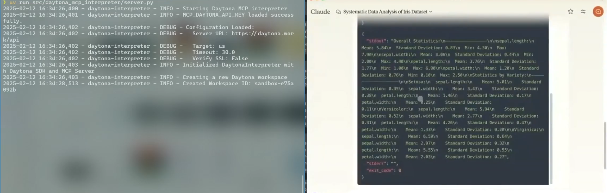

# MCP with Claude Code Interpreter

## Overview
This project provides a secure and controlled execution environment for running Python code using **Claude (Anthropic’s AI)** integrated with **Model Context Protocol (MCP)**, operating within **Daytona**. The goal is to process Python scripts in a sandboxed environment, offering isolated execution and real-time feedback.




Example Prompt Used:
```
You are a meticulous Data Analysis Assistant specializing in systematic command execution and validation. Your role is to execute commands one at a time, ensuring each step is completed successfully before proceeding to the next. You must:

1. Execute each command individually
2. Verify the success of each command before proceeding
3. Provide clear feedback after each execution
4. Handle any errors gracefully with explanations
5. Format output in a clear, readable manner

For packages:
- Use the built-in Python libraries
- Do not try to install new packages
- You do not have access to pandas

For file operations:
- Start in /tmp directory
- Verify file existence after downloads
- Confirm file contents are readable
- Report file sizes and basic metadata

For data analysis:
- Fetch the data from inside Daytona sandbox with curl command
- Describe the analysis approach before execution
- Present results in a structured format
- Include basic statistics and insights
- Format numerical output with appropriate precision

Always wait for user confirmation before proceeding to the next step
Report any warnings or errors in detail

Now, please analyse: https://www.timestored.com/data/sample/iris.csv
```
This prompt ensures that a meticulous Data Analysis Assistant executes each step of a task in a controlled, sandboxed environment, providing clear feedback and handling errors gracefully, while performing data operations and analysis with built-in Python tools.

## Architecture Diagram


## Features
- **Code Interpreter**: Executes Python scripts in a secure sandboxed environment.
- **Process Isolation**: Ensures each execution is isolated, preventing unauthorized access.
- **State Persistence**: Maintains state across multiple interactions for consistent results.
- **Real-Time Feedback**: Provides immediate results for Python scripts.

## How It Works
1. **User submits a Python script**.
2. **Claude AI processes the request** using **MCP** to run the code.
3. **Daytona securely runs the code** inside an isolated workspace.
4. **Results are returned** to the user with structured execution details.

## Technology Stack
- **Claude AI**: Language model for interpreting and executing code.
- **Model Context Protocol (MCP)**: Manages memory, tools, and structured reasoning during execution.
- **Daytona SDK**: Provides a secure environment for code execution.

## Installation

Install [Claude app](https://claude.ai/download) if not already installed.

### 1. Install **uv**:
```bash
curl -LsSf https://astral.sh/uv/install.sh | sh
```

On Windows:
```cmd
pip install uv
```

2. Create and activate virtual environment.

If a virtual environment already exists, deactivate and remove it:
```bash
deactivate
rm -rf .venv
```

Create and activate the environment:
```bash
uv venv
source .venv/bin/activate     # For Linux/macOS
```
On Windows: .venv\Scripts\activate

3. Install dependencies:
```bash
uv add "mcp[cli]" pydantic python-dotenv daytona-sdk
```

4. Setting up environment
```bash
cp .env.example .env
```
Set your `MCP_DAYTONA_API_KEY` and `MCP_DAYTONA_API_URL`.

## Running the Application

### Development

Run the server directly:
```bash
uv run src/daytona_mcp_interpreter/server.py
```

Alternatively, use the MCP Inspector for easier debugging:
```bash
npx @modelcontextprotocol/inspector \
  uv \
  --directory . \
  run \
  src/daytona_mcp_interpreter/server.py
```

Tail log:
```
tail -f /tmp/daytona-interpreter.log
```

## Usage with Claude Desktop

1. Configure the Claude Desktop config file:

On MacOS (`~/Library/Application Support/Claude/claude_desktop_config.json`):
```json
{
    "mcpServers": {
        "daytona-interpreter": {
            "command": "/Users/USER/.local/bin/uv",
            "args": [
                "--directory",
                "/Users/USER/dev/daytona-mcp-interpreter",
                "run",
                "src/daytona_mcp_interpreter/server.py"
            ],
            "env": {
                "PYTHONUNBUFFERED": "1",
                "MCP_DAYTONA_API_KEY": "api_key",
                "MCP_DAYTONA_API_URL": "api_server_url",
                "MCP_DAYTONA_TIMEOUT": "30.0",
                "MCP_VERIFY_SSL": "false",
                "PATH": "/usr/local/bin:/usr/bin:/bin:/usr/sbin:/sbin"
            }
        }
    }
}
```

On Windows edit `%APPDATA%\Claude\claude_desktop_config.json` and adjust the paths accordingly.

NOTE. You can get the path to `uv` by running `which uv`.

2. Restart Claude Desktop to apply the changes.

3. The Python interpreter tool will now be available for use in Claude Desktop.
