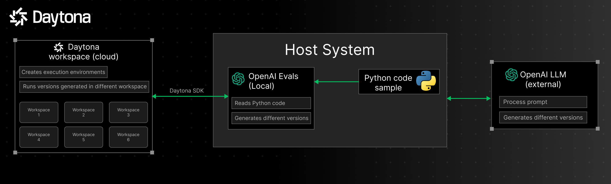
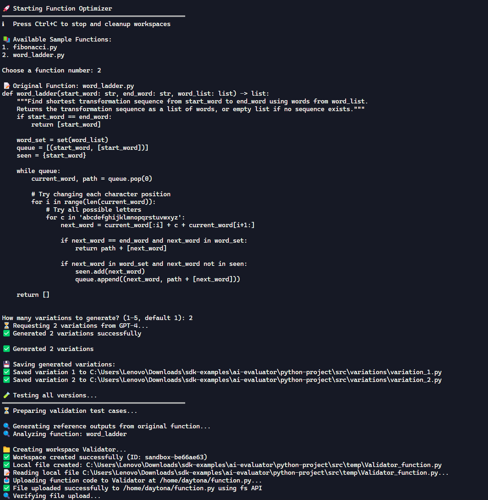
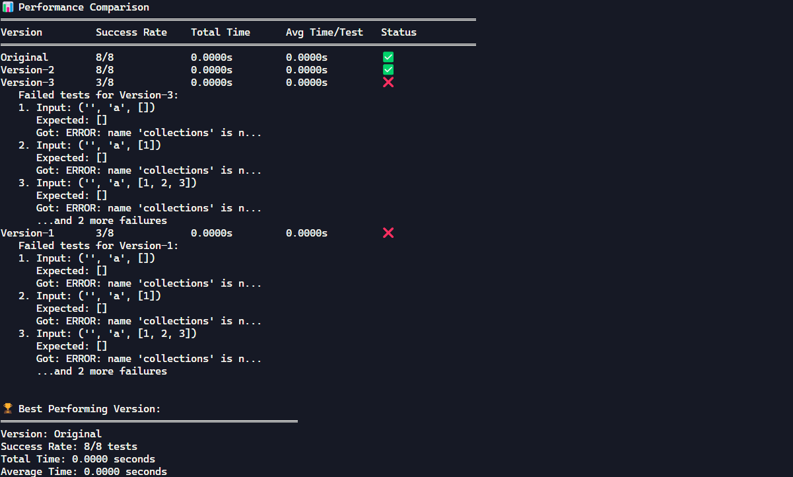
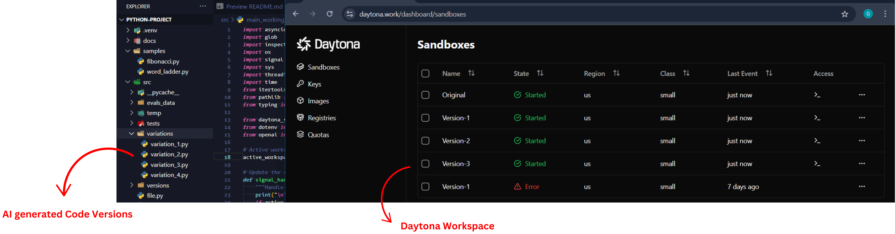

# AI Code Evaluations with OpenAI Evals

This project utilizes **[OpenAI Evals](https://github.com/openai/evals)** to generate and evaluate multiple versions of a given Python function. It follows an **A/B testing approach**, where the LLM creates different function variations, executes them in isolated **Daytona workspaces**, and selects the best-performing version based on execution results.



## How It Works

1. **Host System**
    - The main Python script with OpenAI Evals integration runs on the host system.
    - A **sample Python function** is provided in the `/sample` folder.
    - OpenAI Evals generates **different versions** of the function, each using a different approach or algorithm.

2. **AI Model (Cloud)**
    - The specified **OpenAI model** generates variations of the function based on different logic, performance optimizations, and edge case handling.

3. **Daytona Workspace**
    - Each function version, including the original one, is deployed to an **isolated Daytona workspace** for execution.
    - This ensures that AI-generated code runs in a controlled environment, avoiding security risks.

4. **Evaluation & Best Function Selection**
    - The execution results from all workspaces are collected and analyzed.
    - OpenAI Evals compares outputs based on correctness, efficiency, and error handling.
    - The **best-performing function** is selected based on predefined metrics.

## Installation

To set up the project, clone the repository and install the required dependencies:

```bash
git clone <repository-url>
cd openai-evals-ai-evalutaor
cp .env.example .env               # Make a copy of the .env example
```

Update the .env file with your OpenAI and Daytona API keys.

Create and activate a Python virtual environment:

```bash
python -m venv venv
source venv/bin/activate       # For Linux/macOS
```

On Windows:

```bash
venv\Scripts\activate
```

Install the required dependencies:

```bash
uv pip install -r pyproject.toml
```

Save your Python function inside the `samples/` folder. There is already a sample code included.

To run the AI evaluation process:

```bash
uv run src/main.py
```

The application will prompt you to select the Python file to test and number of versions to generate. OpenAI Evals will generate multiple versions, execute them in Daytona, and select the best-performing one.

Output Files
After execution, some output files will be generated:

`variations_{number}`- Which will contain the generated test cases

The terminal will show the entire process and the best version out of the tested samples.







## Features

- A/B Testing for Python Code: Generates and evaluates multiple versions of a function.
- AI-Powered Function Generation: Uses OpenAI Evals to create optimized function versions.
- Parallel Execution in Daytona: Runs all versions in separate workspaces for accurate comparison.
- Automated Evaluation & Selection: Picks the best function based on correctness, performance, and efficiency.

## Contributing

Contributions are welcome! Please submit a pull request or open an issue for any enhancements or bug fixes.
