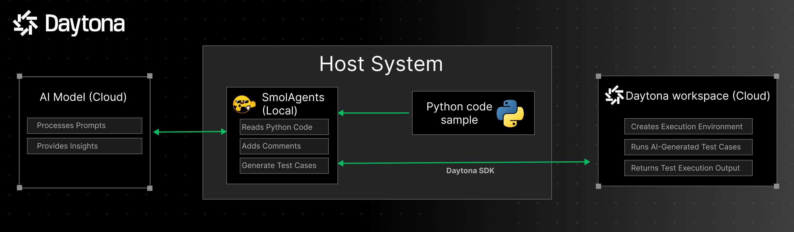
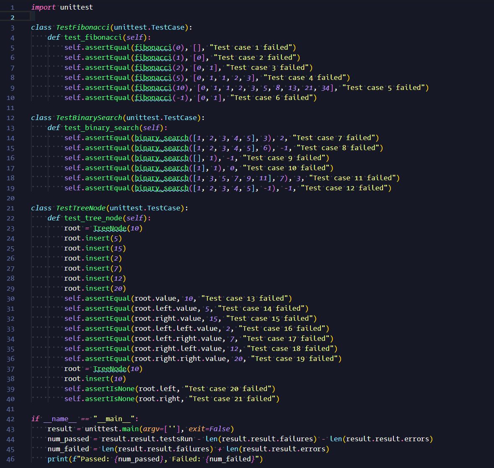
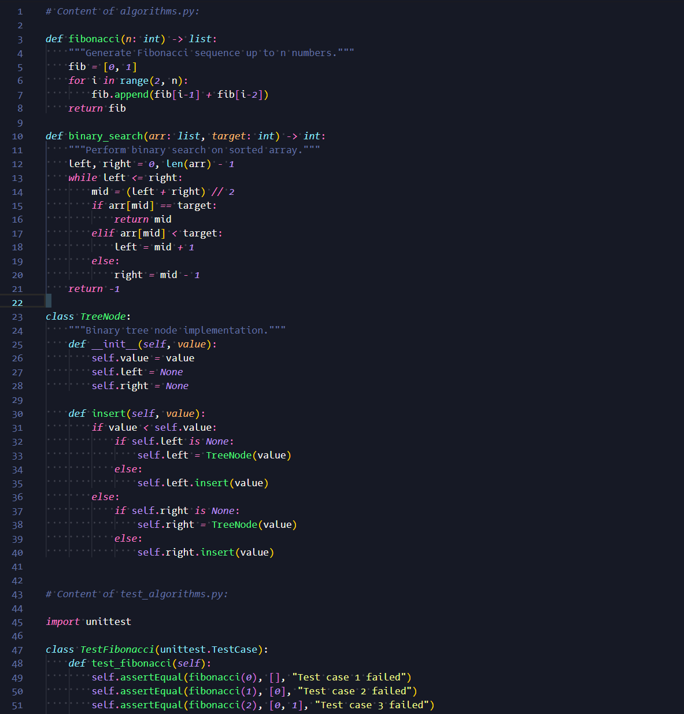

# SmolAgents Project

This project utilizes **[SmolAgents](https://github.com/huggingface/smolagents)** to provide a seamless experience for commenting, running, and testing Python code. It leverages AI-powered agents to interpret the code, generate comments, automatically create tests, and run them in isolated Daytona workspace. The goal is to help users quickly understand and validate their Python code.



## How It Works

1. Host System
    - The main python code with smolagents implementation will be executed on the host system which will scan for a sample python code inside the `/sample` folder.
    - Smolagents will parse the code and comment, run and generate test cases for it.

2. AI Model (Cloud)
    - The specfifed AI Model will generate test cases for the given python code and save it in a new file on the Host System.

3. Daytona workspace
    - The generated test cases will be executed on the isoalted Daytona workspace which ensures no AI generated code runs on the local system which poses a security risk.

## Project Structure

```
smolagents-code-tester
├── src
│   └── main.py                # Entry point of the application
├── .env                             # environment variables required to run
├── pyproject.toml             # Project dependencies
└── readme.md                  # Project documentation
```

## Installation

To set up the project, clone the repository and install the required dependencies:

```bash
git clone <repository-url>
cd smolagents-code-tester
cp .env.example .env               # Make a copy of the .env example
```

Update the .env file with your API Keys and URL.

Create and activate a Python virtual environment:

```bash
uv venv
source .venv/bin/activate       # For Linux/macOS
```

> The test generation works better with bigger models such as `meta-llama/Llama-3.3-70B-Instruct` but it is only available with a Hugging Face Pro subscription. Change the model in the `src/main.py` file as per your needs.

On Windows:
```bash
.venv\Scripts\activate
```

Install the required dependencies:

```bash
uv pip install -r pyproject.toml
```
Save your Python codes in `src/samples` folder. There is already a sample code to test on.

To use the application, run the main.py file:
```bash
uv run src/main.py
```
> The application will prompt you to select the python code to test, which will then be commented on, executed, and tested.

When the execution completes 2 new files will be created:

- `test_{your-file-name}.py` - Which will contain the generated test cases



- `output_{your-file-name}.py` - Which will contain both the sample code and the generated test cases




This `output_{your-file-name}.py` is the one which will be executed on the Daytona Workspace.

## Features
- **Code Commenting**: Automatically generates comments for Python code using SmolAgents.
- **Code Execution**: Runs the provided Python code and captures the output.
- **Automated Testing**: Generates and runs tests on the code.
 - **Real-Time Feedback**: Immediate results for Python code execution and testing.

## Contributing
Contributions are welcome! Please submit a pull request or open an issue for any enhancements or bug fixes.
